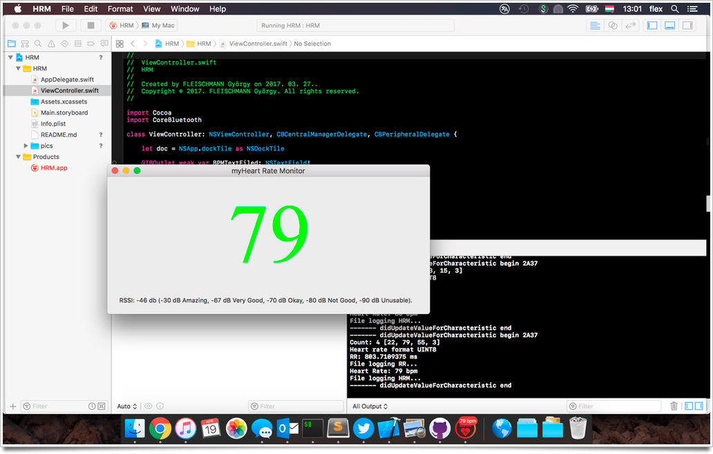

Bluetooth Low Energy BLE mockup on macOS (Swift) with Polar H7 / H10 Heart Rate Monitor
=================================================================================

I always wanted to get closer to a BLE device, here is my first try in Swift.

## myTest platform:

Polar H7 Heart Rate Sensor

Compiled on Xcode Version 12.4 (12D4e) + Swift 5 and tested on macOS Catalina Version 10.15.7 (19H512)

## Links, refs:

The original iOS source came from: https://github.com/jayliew/bluetoothPolarH7Swift

Polar H7 development guide: https://developer.polar.com/wiki/H6_and_H7_Heart_rate_sensors

UUIDs: http://stackoverflow.com/questions/33892310/polar-h7-unresolved-service-and-characteristics-what-are-they-for

Help HR values calculation: http://stackoverflow.com/questions/25456359/how-to-get-data-out-of-bluetooth-characteristic-in-swift

Zero to BLE on iOS (1, 2) https://www.cloudcity.io/blog/2015/06/11/zero-to-ble-on-ios-part-one/ https://www.cloudcity.io/blog/2016/09/09/zero-to-ble-on-ios--part-two---swift-edition/

## Features:

- "continuous" RSSI 
- icon badge HR bpm
- bpm and rr file logging
- simple reconnect

## Screenshot:



## My console messages:

```
- viewDidLoad begin
- viewDidLoad end

-- centralManagerDidUpdateState begin
-- central state is poweredOn
-- Start scanning...
-- centralManagerDidUpdateState end

--- didDiscover peripheral begin
--- ??? advertisementData[CBAdvertisementDataLocalNameKey] nil
--- didDiscover peripheral end
--- didDiscover peripheral begin
--- Found POLAR H7 heart rate monitor named: Polar H7 470F1F17.
--- Found POLAR H7 heart rate monitor  RSSI: -43 db (-30 dB Amazing, -67 dB Very Good, -70 dB Okay, -80 dB Not Good, -90 dB Unusable).
--- Stop scanning
--- didDiscover peripheral end

---- didConnectPeripheral begin
---- peripheral state is 2
---- didConnectPeripheral end

----- didDiscoverServices begin
+++++ Service: Unknown (<180d>)
--------------------------------------------
Service UUID: 180D
Service isPrimary: false
Service isProxy: false
--------------------------------------------
+++++ Service: Device Information
--------------------------------------------
Service UUID: 180A
Service isPrimary: false
Service isProxy: false
--------------------------------------------
+++++ Service: Battery
--------------------------------------------
Service UUID: 180F
Service isPrimary: false
Service isProxy: false
--------------------------------------------
+++++ Service: Unknown (<6217ff4b fb311140 ad5aa455 45d7ecf3>)
--------------------------------------------
Service UUID: 6217FF4B-FB31-1140-AD5A-A45545D7ECF3
Service isPrimary: false
Service isProxy: false
--------------------------------------------
----- didDiscoverServices end

------ didDiscoverCharacteristicsFor begin nil UUID Unknown (<180d>)
++++++ Heart Rate Service
------ Found Heart Rate Measurement Characteristic
--------------------------------------------
Characteristic UUID: Unknown (<2a37>)
Characteristic UUID: 2A37
Characteristic isNotifying: false
Characteristic properties: CBCharacteristicProperties(rawValue: 16)
Characteristic descriptors: nil
Characteristic value: nil
--------------------------------------------
------ Found Body Sensor Location Characteristic
--------------------------------------------
Characteristic UUID: Unknown (<2a38>)
Characteristic UUID: 2A38
Characteristic isNotifying: false
Characteristic properties: CBCharacteristicProperties(rawValue: 2)
Characteristic descriptors: nil
Characteristic value: nil
--------------------------------------------
------ didDiscoverCharacteristicsFor end =====================================================
------ didDiscoverCharacteristicsFor begin nil UUID Device Information
++++++ Found Device Information
------ System ID
--------------------------------------------
Characteristic UUID: System ID
Characteristic UUID: 2A23
Characteristic isNotifying: false
Characteristic properties: CBCharacteristicProperties(rawValue: 2)
Characteristic descriptors: nil
Characteristic value: nil
--------------------------------------------

--------------------------------------------
Characteristic UUID: Model Number String
Characteristic UUID: 2A24
Characteristic isNotifying: false
Characteristic properties: CBCharacteristicProperties(rawValue: 2)
Characteristic descriptors: nil
Characteristic value: nil
--------------------------------------------
------ Serial Number String
--------------------------------------------
Characteristic UUID: Serial Number String
Characteristic UUID: 2A25
Characteristic isNotifying: false
Characteristic properties: CBCharacteristicProperties(rawValue: 2)
Characteristic descriptors: nil
Characteristic value: nil
--------------------------------------------
------ Firmware Revision String
--------------------------------------------
Characteristic UUID: Firmware Revision String
Characteristic UUID: 2A26
Characteristic isNotifying: false
Characteristic properties: CBCharacteristicProperties(rawValue: 2)
Characteristic descriptors: nil
Characteristic value: nil
--------------------------------------------
------ Hardware Revision String
--------------------------------------------
Characteristic UUID: Hardware Revision String
Characteristic UUID: 2A27
Characteristic isNotifying: false
Characteristic properties: CBCharacteristicProperties(rawValue: 2)
Characteristic descriptors: nil
Characteristic value: nil
--------------------------------------------
------ Software Revision String
--------------------------------------------
Characteristic UUID: Software Revision String
Characteristic UUID: 2A28
Characteristic isNotifying: false
Characteristic properties: CBCharacteristicProperties(rawValue: 2)
Characteristic descriptors: nil
Characteristic value: nil
--------------------------------------------
------ Manufacturer Name String
--------------------------------------------
Characteristic UUID: Manufacturer Name String
Characteristic UUID: 2A29
Characteristic isNotifying: false
Characteristic properties: CBCharacteristicProperties(rawValue: 2)
Characteristic descriptors: nil
Characteristic value: nil
--------------------------------------------
------ didDiscoverCharacteristicsFor end =====================================================
------ didDiscoverCharacteristicsFor begin nil UUID Battery
++++++ Found Battery Service
------ Battery Level
--------------------------------------------
Characteristic UUID: Battery Level
Characteristic UUID: 2A19
Characteristic isNotifying: false
Characteristic properties: CBCharacteristicProperties(rawValue: 2)
Characteristic descriptors: nil
Characteristic value: nil
--------------------------------------------
------ didDiscoverCharacteristicsFor end =====================================================
------ didDiscoverCharacteristicsFor begin nil UUID Unknown (<6217ff4b fb311140 ad5aa455 45d7ecf3>)
------ didDiscoverCharacteristicsFor end =====================================================

------- didUpdateValueForCharacteristic begin 2A38
UPDATING Sensor Locaton: 1 (0 Other, 1 Chest, 2 Wrist, 3 Finger, 4 Hand, 5 Ear Lobe, 6 Foot, 7 - 255 Reserved for future use)
------- didUpdateValueForCharacteristic end
------- didUpdateValueForCharacteristic begin 2A23
UPDATING System ID: [31, 15, 71, 254, 255, 208, 34, 0]
------- didUpdateValueForCharacteristic end
------- didUpdateValueForCharacteristic begin 2A25
UPDATING Serial Number: 1409139472
------- didUpdateValueForCharacteristic end
------- didUpdateValueForCharacteristic begin 2A26
UPDATING Firmware Revision: 1.3.2
------- didUpdateValueForCharacteristic end
------- didUpdateValueForCharacteristic begin 2A27
UPDATING Hardware Revision: 39044024.08
------- didUpdateValueForCharacteristic end
------- didUpdateValueForCharacteristic begin 2A28
UPDATING SW v: H7 2.1.0
------- didUpdateValueForCharacteristic end
------- didUpdateValueForCharacteristic begin 2A29
UPDATING Manufact: Polar Electro Oy
------- didUpdateValueForCharacteristic end
------- didUpdateValueForCharacteristic begin 2A19
UPDATING Battery Level: 70%
------- didUpdateValueForCharacteristic end
------- didUpdateValueForCharacteristic begin 2A37
Count: 2 [6, 82]
Heart rate format UINT8
Heart Rate: 82 bpm
File logging HRM...
------- didUpdateValueForCharacteristic end
------- didUpdateValueForCharacteristic begin 2A37
Count: 4 [22, 84, 153, 2]
Heart rate format UINT8
RR: 649.4140625 ms
File logging RR...
Heart Rate: 84 bpm
File logging HRM...
------- didUpdateValueForCharacteristic end
------- didUpdateValueForCharacteristic begin 2A37
Count: 6 [22, 86, 145, 2, 162, 2]
Heart rate format UINT8
RR: 641.6015625 ms
File logging RR...
RR: 658.203125 ms
File logging RR...
Heart Rate: 86 bpm
File logging HRM...
------- didUpdateValueForCharacteristic end
------- didUpdateValueForCharacteristic begin 2A37
Count: 4 [22, 86, 197, 2]
Heart rate format UINT8
RR: 692.3828125 ms
File logging RR...
Heart Rate: 86 bpm
File logging HRM...
------- didUpdateValueForCharacteristic end
.
.
.
```

## Example log:

hrm.log:

date;time;bpm;rr(s)

```
20170419;110328;77;796
20170419;110329;77;766
20170419;110330;77;770;759
20170419;110331;77;756
20170419;110332;79;731;713
20170419;110333;79;719
20170419;110334;80;729
20170419;110335;80;732;721
20170419;110336;80;750
20170419;110337;80;766
20170419;110338;80;771;747
20170419;110339;80;740
20170419;110340;80;747
20170419;110341;80;754;717
20170419;110342;81;708
20170419;110343;82;698;690
20170419;110344;83;673
20170419;110345;84;670
20170419;110346;85;690;689
20170419;110347;84;710
```

rr.log:

```
820.3125
791.9921875
786.1328125
793.9453125
797.8515625
770.5078125
774.4140625
775.390625
783.203125
773.4375
750.9765625
758.7890625
758.7890625
755.859375
730.46875
730.46875
741.2109375
746.09375
760.7421875
743.1640625
728.515625
731.4453125
703.125
692.3828125
683.59375
683.59375
696.2890625
709.9609375
732.421875
742.1875
742.1875
```

Credits @FleXoft gyorgy@fleischmann.hu
